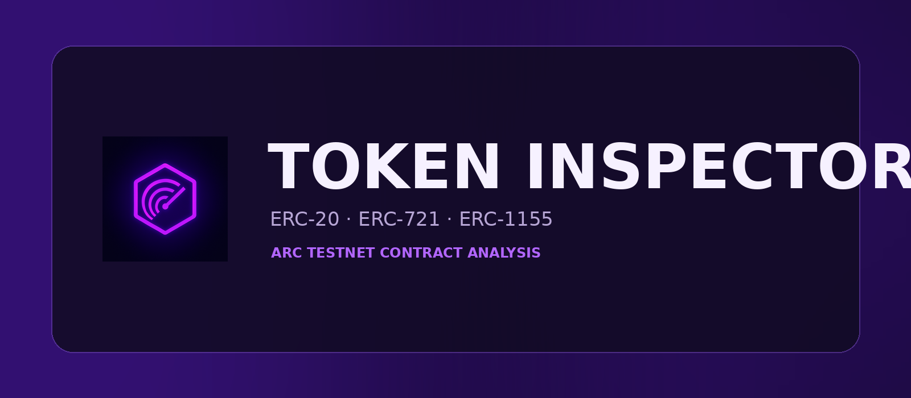

<p align="center">
  
</p>

<h1 align="center">🔍 Token Analyzer V2.2</h1>

<p align="center">
  Inspect ERC-20, ERC-721 and ERC-1155 token contracts on Arc Testnet.
</p>

<p align="center">
  
  
  
</p>

---

## Overview

**Token Analyzer** reads token and contract information without requiring a wallet connection.

Paste a contract address to view:

- Token standard: ERC-20, ERC-721, ERC-1155 and other ArcScan-indexed standards
- Token name and symbol
- Decimals when applicable
- Total supply when the contract exposes it
- ArcScan holder count
- Contract source verification
- Common proxy signals
- RPC provider and analyzed block

The analyzer combines direct contract calls, ERC-165 interface checks and ArcScan/Blockscout token data. Missing `decimals()` is not treated as an error for ERC-721 or ERC-1155 contracts.

---

## Important V2.2 fix

The earlier version only accepted ERC-20 signals. Because of that, valid ArcScan tokens such as **InfinityName (INAME)** were incorrectly shown as ordinary contracts.

V2.2 now recognizes:

- ERC-20 fungible tokens
- ERC-721 NFTs
- ERC-1155 multi-token contracts
- ERC-404, ERC-777 and ERC-4626 when ArcScan identifies the type
- Wallet addresses and non-token contracts

---

## Project structure

```text
api/
├── _lib/
│   └── arc.js
├── arc-token.js
├── detect-address.js
└── network-status.js
README.md
banner.png
bg-squares.js
favicon.png
index.html
style.css
tokens.js
package.json
vercel.json
```

---

## Deployment

This repository is designed for Vercel.

1. Upload every file and preserve the `api/_lib/arc.js` path.
2. Commit the changes to the `main` branch.
3. Vercel will redeploy the project connected to the repository.
4. Test these addresses:

```text
USDC · ERC-20
0x3600000000000000000000000000000000000000

InfinityName · ERC-721
0x76a816EFa69e3183972ff7a231F5C8d7b065d9De

GMCards · ERC-721
0x363cC75a89aE5673b427a1Fa98AFc48FfDE7Ba43
```

---

## Live app

https://token-analyzer-omega.vercel.app/

## Repository

https://github.com/joaodd1590-sys/token-analyzer

---

Built by João Carlos for the Arc ecosystem community.
